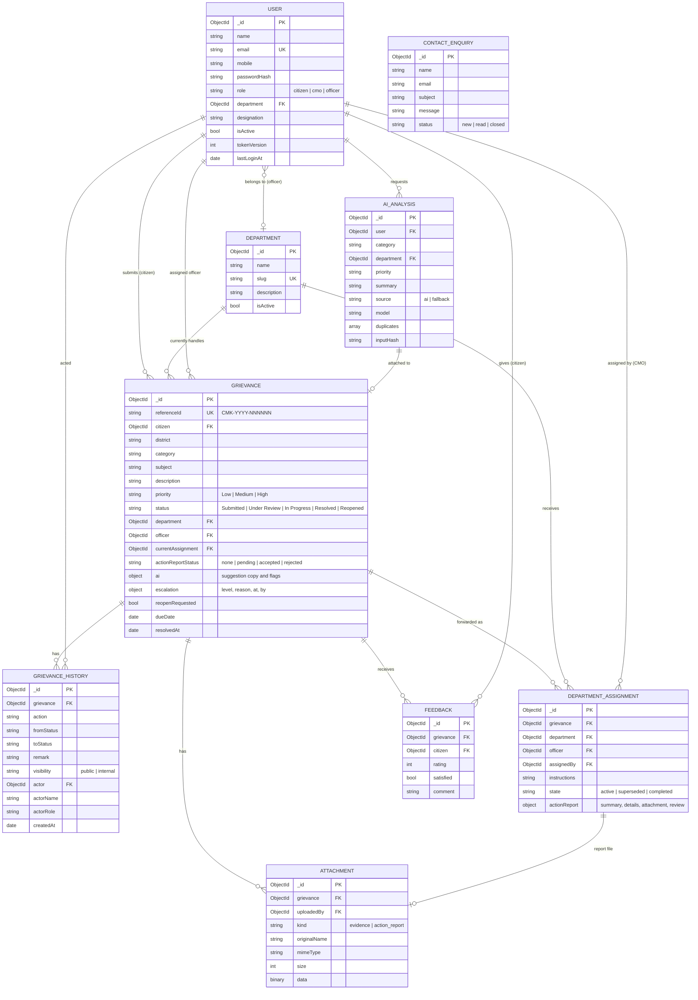

# Database ER diagram

```mermaid
erDiagram
  USER ||--o{ GRIEVANCE : "submits (citizen)"
  USER }o--o| DEPARTMENT : "belongs to (officer)"
  DEPARTMENT ||--o{ GRIEVANCE : "currently handles"
  USER ||--o{ GRIEVANCE : "assigned officer"
  GRIEVANCE ||--o{ GRIEVANCE_HISTORY : "has"
  USER ||--o{ GRIEVANCE_HISTORY : "acted"
  GRIEVANCE ||--o{ DEPARTMENT_ASSIGNMENT : "forwarded as"
  DEPARTMENT ||--o{ DEPARTMENT_ASSIGNMENT : "receives"
  USER ||--o{ DEPARTMENT_ASSIGNMENT : "assigned by (CMO)"
  GRIEVANCE ||--o{ ATTACHMENT : "has"
  DEPARTMENT_ASSIGNMENT ||--o| ATTACHMENT : "report file"
  GRIEVANCE ||--o{ FEEDBACK : "receives"
  USER ||--o{ FEEDBACK : "gives (citizen)"
  USER ||--o{ AI_ANALYSIS : "requests"
  AI_ANALYSIS ||--o| GRIEVANCE : "attached to"

  USER {
    ObjectId _id PK
    string name
    string email UK
    string mobile
    string passwordHash
    string role "citizen | cmo | officer"
    ObjectId department FK
    string designation
    bool isActive
    int tokenVersion
    date lastLoginAt
  }
  DEPARTMENT {
    ObjectId _id PK
    string name
    string slug UK
    string description
    bool isActive
  }
  GRIEVANCE {
    ObjectId _id PK
    string referenceId UK "CMK-YYYY-NNNNNN"
    ObjectId citizen FK
    string district
    string category
    string subject
    string description
    string priority "Low | Medium | High"
    string status "Submitted | Under Review | In Progress | Resolved | Reopened"
    ObjectId department FK
    ObjectId officer FK
    ObjectId currentAssignment FK
    string actionReportStatus "none | pending | accepted | rejected"
    object ai "suggestion copy and flags"
    object escalation "level, reason, at, by"
    bool reopenRequested
    date dueDate
    date resolvedAt
  }
  GRIEVANCE_HISTORY {
    ObjectId _id PK
    ObjectId grievance FK
    string action
    string fromStatus
    string toStatus
    string remark
    string visibility "public | internal"
    ObjectId actor FK
    string actorName
    string actorRole
    date createdAt
  }
  DEPARTMENT_ASSIGNMENT {
    ObjectId _id PK
    ObjectId grievance FK
    ObjectId department FK
    ObjectId officer FK
    ObjectId assignedBy FK
    string instructions
    string state "active | superseded | completed"
    object actionReport "summary, details, attachment, review"
  }
  ATTACHMENT {
    ObjectId _id PK
    ObjectId grievance FK
    ObjectId uploadedBy FK
    string kind "evidence | action_report"
    string originalName
    string mimeType
    int size
    binary data
  }
  FEEDBACK {
    ObjectId _id PK
    ObjectId grievance FK
    ObjectId citizen FK
    int rating
    bool satisfied
    string comment
  }
  CONTACT_ENQUIRY {
    ObjectId _id PK
    string name
    string email
    string subject
    string message
    string status "new | read | closed"
  }
  AI_ANALYSIS {
    ObjectId _id PK
    ObjectId user FK
    string category
    ObjectId department FK
    string priority
    string summary
    string source "ai | fallback"
    string model
    array duplicates
    string inputHash
  }
```
