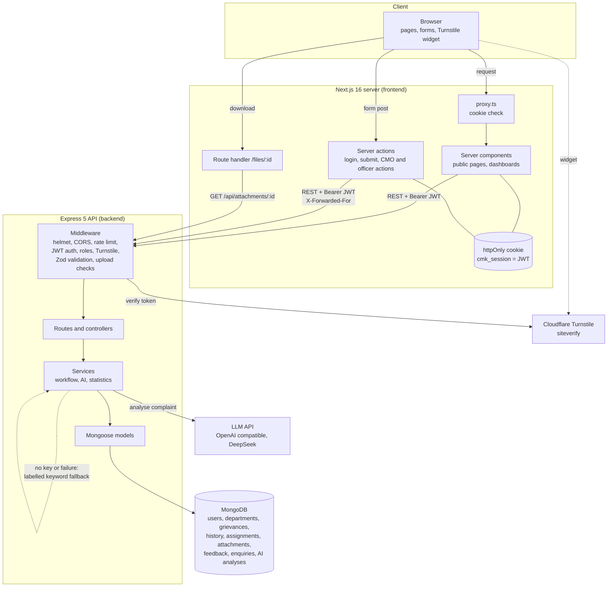
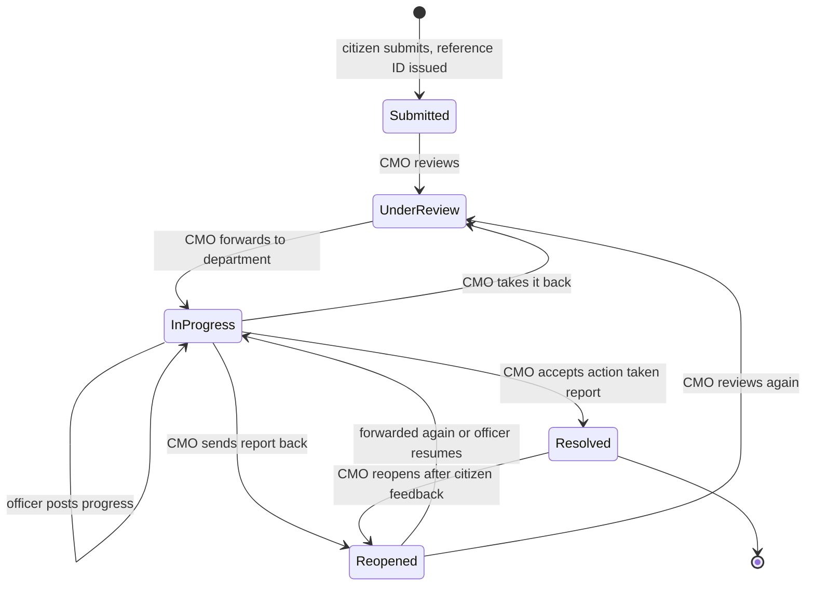

# System architecture diagram

```mermaid
flowchart TB
  subgraph Client
    Browser["Browser<br/>pages, forms, Turnstile widget"]
  end

  subgraph Web["Next.js 16 server (frontend)"]
    Pages["Server components<br/>public pages, dashboards"]
    Actions["Server actions<br/>login, submit, CMO and officer actions"]
    Files["Route handler /files/:id"]
    Proxy["proxy.ts<br/>cookie check"]
    Cookie[("httpOnly cookie<br/>cmk_session = JWT")]
  end

  subgraph Api["Express 5 API (backend)"]
    MW["Middleware<br/>helmet, CORS, rate limit,<br/>JWT auth, roles, Turnstile,<br/>Zod validation, upload checks"]
    Routes["Routes and controllers"]
    Services["Services<br/>workflow, AI, statistics"]
    Models["Mongoose models"]
  end

  DB[("MongoDB<br/>users, departments, grievances,<br/>history, assignments, attachments,<br/>feedback, enquiries, AI analyses")]
  CF["Cloudflare Turnstile<br/>siteverify"]
  LLM["LLM API<br/>OpenAI compatible, DeepSeek"]

  Browser -->|request| Proxy --> Pages
  Browser -->|form post| Actions
  Browser -->|download| Files
  Browser -. widget .-> CF
  Pages --- Cookie
  Actions --- Cookie
  Pages -->|"REST + Bearer JWT"| MW
  Actions -->|"REST + Bearer JWT<br/>X-Forwarded-For"| MW
  Files -->|"GET /api/attachments/:id"| MW
  MW --> Routes --> Services --> Models --> DB
  MW -->|verify token| CF
  Services -->|"analyse complaint"| LLM
  Services -. "no key or failure:<br/>labelled keyword fallback" .-> Services
```

## Grievance workflow

```mermaid
stateDiagram-v2
  [*] --> Submitted: citizen submits, reference ID issued
  Submitted --> UnderReview: CMO reviews
  UnderReview --> InProgress: CMO forwards to department
  InProgress --> InProgress: officer posts progress
  InProgress --> UnderReview: CMO takes it back
  InProgress --> Resolved: CMO accepts action taken report
  InProgress --> Reopened: CMO sends report back
  Resolved --> Reopened: CMO reopens after citizen feedback
  Reopened --> InProgress: forwarded again or officer resumes
  Reopened --> UnderReview: CMO reviews again
  Resolved --> [*]
```
